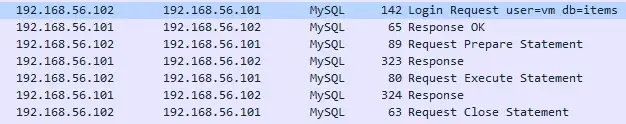
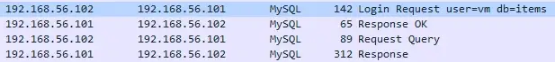
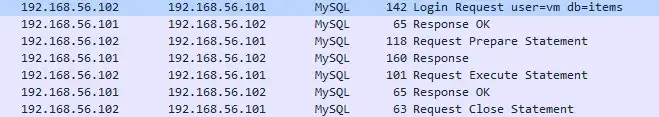
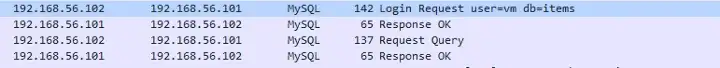
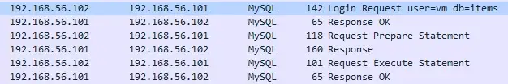

# Acesso ao banco de dados
A linguagem Go, através da biblioteca nativa `database/sql`, fornece diversos recursos para manipular bases de dados relacionais. Sua API disponibiliza vários métodos que visam abstrair funcionalidades cotidianas. Entretanto, graças a enorme abundância de funções expostas pelo pacote, eventualmente, dúvidas acerca do assunto são geradas. Tendo isso em vista, esse pequeno texto visa esclarecer algumas dessas questões, as quais são tão comuns entre os programadores Go.

## DB e Conn
Este bloco visa esclarecer as principais diferenças entre os objetos `sql.DB` e `sql.Conn`, providos pela API a fim de abstrair o acesso aos serviços de banco de dados. Parte do conteúdo foi extraído e traduzido do artigo [The DB Connection Confusion in Go](https://aloksinhanov.medium.com/the-db-connection-confusion-in-go-d48574c399c5 "The DB Connection Confusion in Go").

### DB
O objeto `sql.DB` deve ser utilizado na maioria das vezes nas quais deseja-se realizar conexões com serviços de banco de dados. Como pode-se notar na própria [documentação da linguagem](https://go.dev/doc/database/manage-connections "documentação da linguagem"), o uso da funcionalidade é amplamente recomentado. Abaixo estão listadas algumas das principais características providas pelo seu uso:

1. Por baixo dos panos, o objeto representa uma _connection pool_. Dessa maneira, para cada ação disparada no `sql.DB`, uma conexão é resgada, utilizada e devolvida. Assim, otimizando o sistema de acesso ao banco.
2. O sistema provê um mecanismo de recuperação automática nos casos de falha. Dessa maneira, caso haja problemas de conexão durante a execução de um processo, será automaticamente escolhida outra conexão para rodar o comado. Deve-se reforçar que essa trativa ocorrerá no máximo 10 vezes, assim, impedindo que o programa trave.

## Query, Exec e Prepare
Essa seção visa sanar alguns questionamentos relacionadas ao uso dos métodos de consulta/manipulação mais comuns da API. Com fins ilustrativos, imagens que demonstram as chamadas realizadas por baixo dos panos serão exibidas.

Em suma, o conteúdo do bloco foi traduzido do artigo [Query vs Exec vs Prepare in Go](https://aloksinhanov.medium.com/query-vs-exec-vs-prepare-in-golang-e7c49212c36c "Query vs Exec vs Prepare in Go").

### Query
O método `Query` deve ser utilizado **apenas** nos casos nos quais deseja-se executar operações que possuam retornos significativos. Ao utilizar o método, o desenvolvedor deve prestar atenção aos seguintes pontos:

1. Após a iteração dos dados ou com a chamada do método `Close()`, presente nas linhas retornadas pela função, a conexão será liberada. Por isso, o retorno do método **nunca** deve ser ignorado.
2. O total de chamadas ao banco de dados vária conforme o preparo do método. Como pode-se notar nos mapeamentos anexados, ao executar o método sem inferir parâmetros, será realizada apenas uma chamada TCP ao serviço de banco de dados(ignorando a autenticação). Entretanto, ao atribuir parâmetros, serão realizadas 3 chamadas TCP. Nota-se que ao parametrizar uma chamada, por baixo dos panos, será gerado um _prepared statement_.

**Mapeamento QUERY com parâmetros:**



**Mapeamento QUERY sem parâmetros:**



**Sintaxe do comando:**
```
rows, err := db.Query("select * from...”, PARÂMETROS)
```

### Exec
O método `Exec` deve ser utilizado **apenas** nos casos nos quais deseja-se executar operações que possuam retornos irrelevantes. Essa característica é geralmente atribuída as chamadas **insert**, **update** e **delete**. Ao utilizar o método, o desenvolvedor deve-se manter atento aos seguintes detalhes:

1. Após a execução do método, a conexão utilizada será liberada automaticamente.
2. Assim como no método `Query`, o número de chamadas ao banco de dados difere, dependendo de como a invocação do método for realizada. Como pode-se notar nos mapeamentos anexados, ao executar o método sem inferir parâmetros, será realizada apenas uma chamada TCP ao serviço de banco de dados(ignorando a autenticação). Entretanto, ao atribuir parâmetros, serão realizadas 3 chamadas TCP. Nota-se que ao parametrizar uma chamada, por baixo dos panos, será gerado um _prepared statement_.

**Mapeamento EXEC com parâmetros:**



**Mapeamento EXEC sem parâmetros:**



**Sintaxe do comando:**
```
result, err := db.Exec("insert into items(Col1, Col2, Col3)...”, PARÂMETROS)
```

### Prepare
O método `Prepare` deve ser utilizado **apenas** nos casos nos quais deseja-se executar o mesmo statement **N** vezes durante o ciclo de vida do programa. Ao usar essa funcionalidade, o programador deve-se atentar aos seguintes detalhes:

1. A partir do ponto que o _prepared statement_ não for mais necessário, o próprio deve ser finalizado. Para isso, o método `Close()`, contido no próprio statement deve ser executado. Caso contrário, os recursos alocados para seu funcionamento não serão liberados.
2. Como pode-se notar no mapeamento, ao invocar a função, serão realizadas 3 chamadas TCP para sua execução(ignorando a autenticação).

**Mapeamento PREPARE:**



**Sintaxe do comando:**
```
stm, err := db.Prepare("insert into items(Col1, Col2, Col3) values(?, ?, ?)”, “Val1”, "Val2", "Val3")
```
